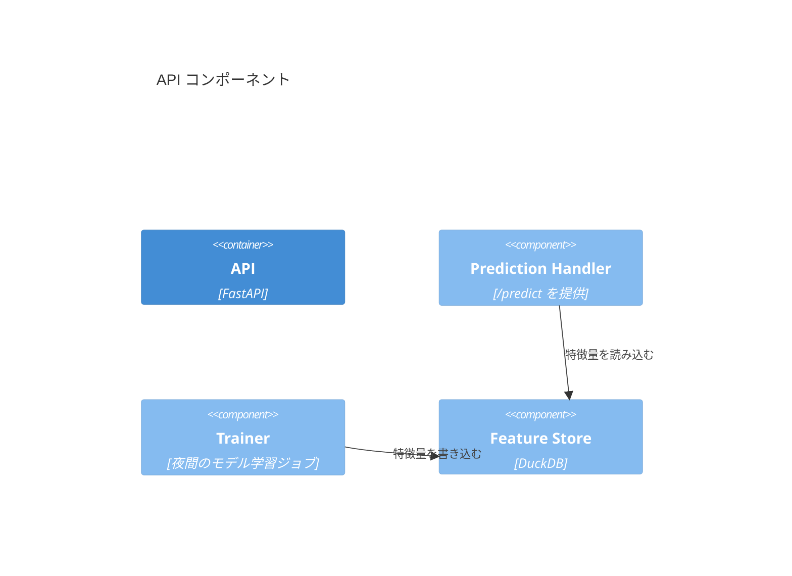

# アーキテクチャ

このドキュメントは C4 モデル図を用いて Keirin Prediction AI プラットフォームのアーキテクチャを概説します。

## コンテキスト

```mermaid
C4Context
title Keirin Prediction AI - コンテキスト
Person(user, "競輪ファン")
System_Boundary(platform, "Keirin 予測プラットフォーム") {
  System(api, "REST API", "予測を提供")
  System(web, "Web フロントエンド", "オッズと予測を表示")
}
System_Ext(data, "公式レースデータ")
Rel(user, web, "予測を閲覧")
Rel(web, api, "HTTP リクエスト")
Rel(api, data, "レースデータを取り込む")
```

## コンテナ

```mermaid
C4Container
title Keirin Prediction AI - コンテナ
Person(user, "競輪ファン")
System_Boundary(platform, "Keirin 予測プラットフォーム") {
  Container(web, "Web", "Next.js", "ユーザーインターフェース")
  Container(api, "API", "FastAPI", "ビジネスロジックと ML 推論")
  ContainerDb(db, "PostgreSQL", "レースおよびモデルデータ")
}
Rel(user, web, "利用")
Rel(web, api, "HTTP")
Rel(api, db, "SQL")
```

## コンポーネント (API)

```mermaid
C4Component
title API コンポーネント
Container(api, "API", "FastAPI")
Component(handler, "Prediction Handler", "/predict を提供")
Component(trainer, "Trainer", "夜間のモデル学習ジョブ")
Component(store, "Feature Store", "DuckDB")
Rel(handler, store, "特徴量を読み込む")
Rel(trainer, store, "特徴量を書き込む")
```

