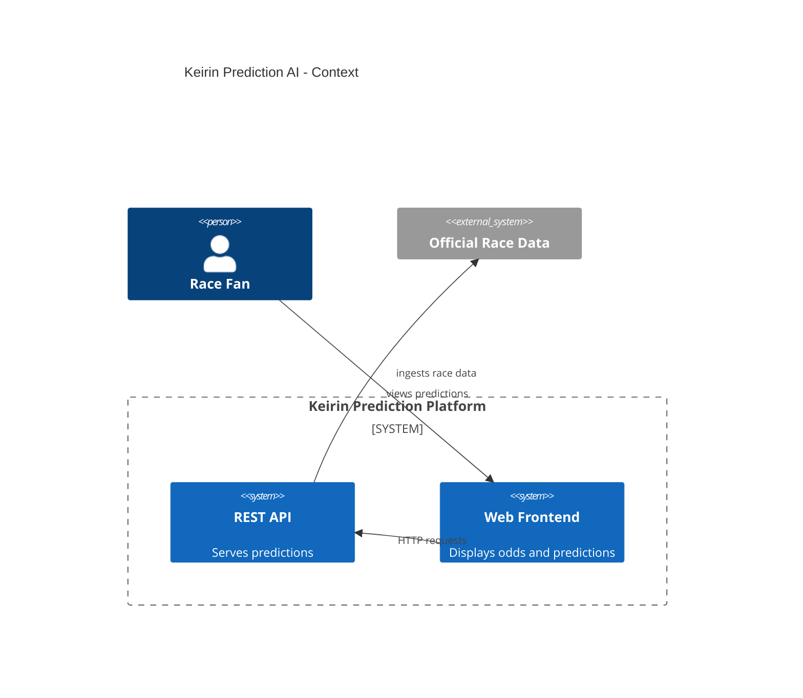
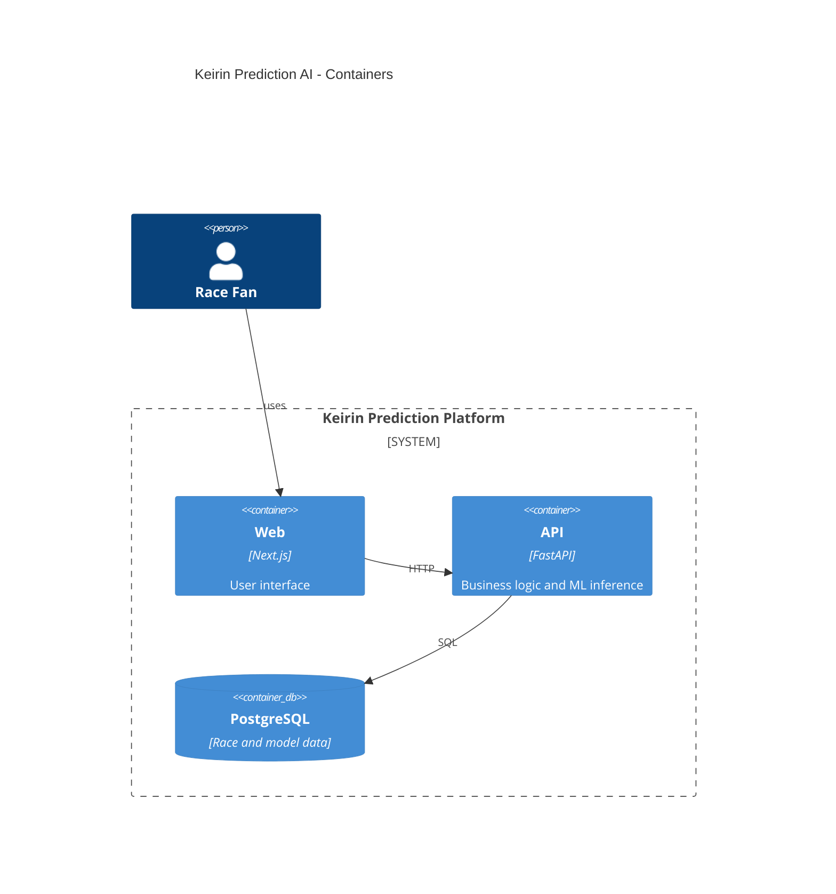
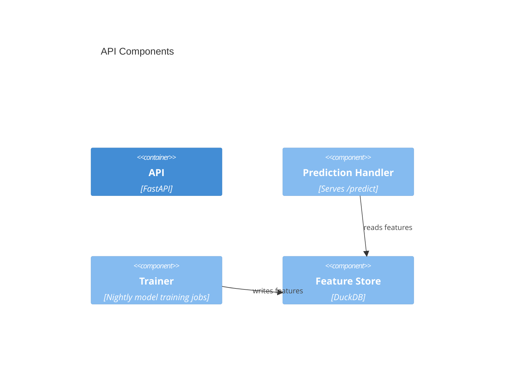

# Architecture

This document outlines the architecture of the Keirin Prediction AI platform using C4 model diagrams.

## Context

```mermaid
C4Context
title Keirin Prediction AI - Context
Person(user, "Race Fan")
System_Boundary(platform, "Keirin Prediction Platform") {
  System(api, "REST API", "Serves predictions")
  System(web, "Web Frontend", "Displays odds and predictions")
}
System_Ext(data, "Official Race Data")
Rel(user, web, "views predictions")
Rel(web, api, "HTTP requests")
Rel(api, data, "ingests race data")
```

## Container

```mermaid
C4Container
title Keirin Prediction AI - Containers
Person(user, "Race Fan")
System_Boundary(platform, "Keirin Prediction Platform") {
  Container(web, "Web", "Next.js", "User interface")
  Container(api, "API", "FastAPI", "Business logic and ML inference")
  ContainerDb(db, "PostgreSQL", "Race and model data")
}
Rel(user, web, "uses")
Rel(web, api, "HTTP")
Rel(api, db, "SQL")
```

## Component (API)

```mermaid
C4Component
title API Components
Container(api, "API", "FastAPI")
Component(handler, "Prediction Handler", "Serves /predict")
Component(trainer, "Trainer", "Nightly model training jobs")
Component(store, "Feature Store", "DuckDB")
Rel(handler, store, "reads features")
Rel(trainer, store, "writes features")
```
